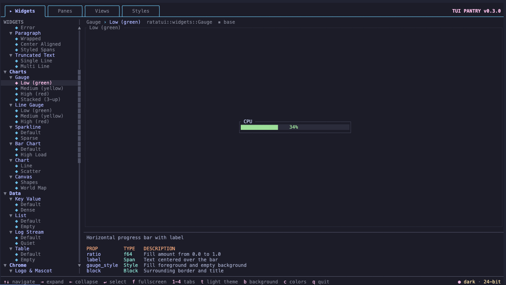
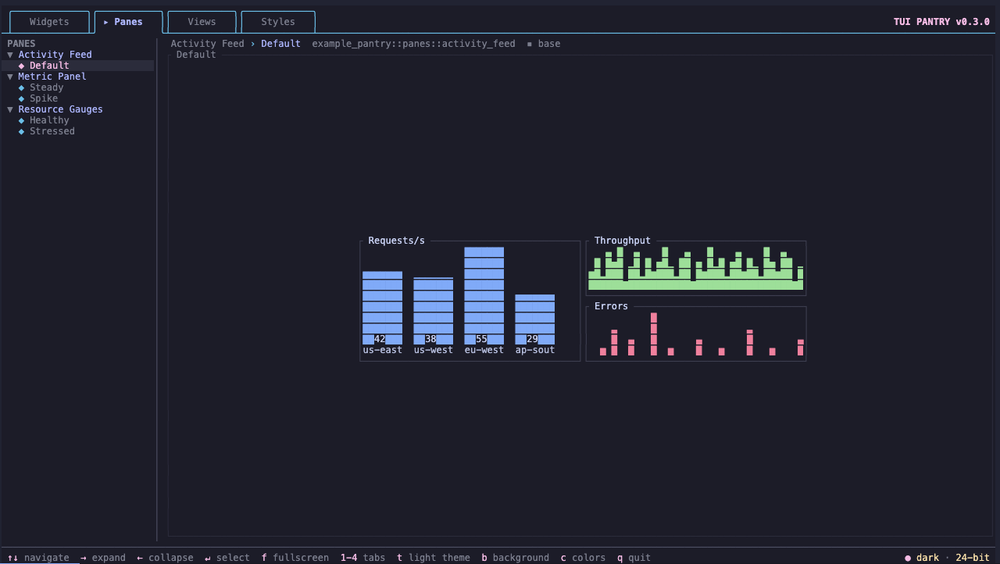
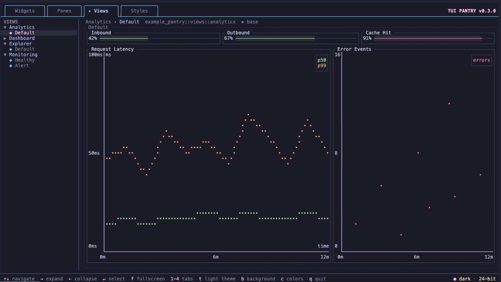
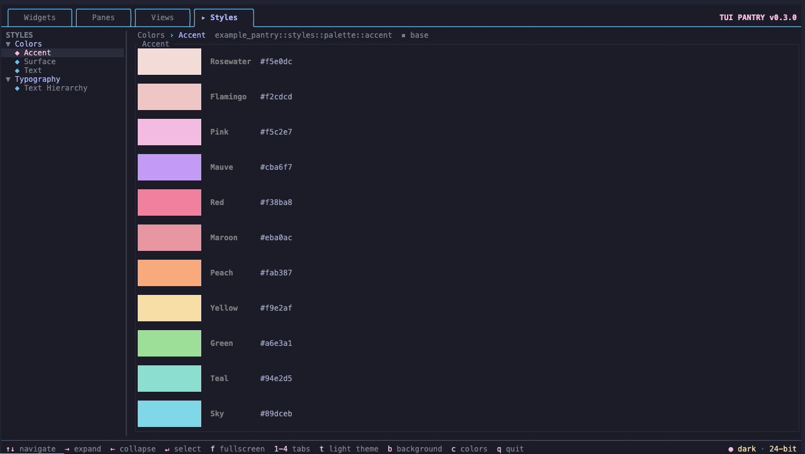

# tui-pantry

[](LICENSE-MIT)
[](https://github.com/taho-inc/tui-pantry/actions)

Tui-pantry is a component-driven development library for [ratatui](https://ratatui.rs). Build, preview, and iterate on terminal widgets in isolation, outside of your application, with zero application dependencies. If you've used [Storybook](https://storybook.js.org/), this should feel familiar.

**[Full documentation →](https://docs.taho.is/tui-pantry)**

Your widget crate declares *ingredients* (preview configurations), and tui-pantry renders them in an [interactive terminal browser](https://docs.taho.is/tui-pantry/the-pantry) with live navigation, color depth emulation, and stylesheet support. Ingredients organize into four tabs:
* **Widgets** for atomic components
* **Panes** for composed sections like metric panels and data feeds
* **Views** for full-page layouts
* **Styles** for color palettes and typography

Your entire design surface is browsable in one place. Three steps to integrate: see [Quick Start](#quick-start) or the [installation guide](https://docs.taho.is/tui-pantry/installation).

## Screenshots

| Tab | Screenshot | Description |
|-----|------------|-------------|
| **Widgets** |  | Atomic components in isolation: gauges, sparklines, bar charts, tables, each with prop documentation and source breadcrumbs. |
| **Panes** |  | Composed sections combining multiple widgets into cohesive panels. Resource gauges, activity feeds with bar charts and sparklines side by side. |
| **Views** |  | Full-page layouts assembling panes and widgets into complete screens. Monitoring dashboards with gauge rows, chart panels, and service tables. |
| **Styles** |  | Color palettes and typography driven from `pantry.toml`. Named swatches with hex values, grouped by family, plus text hierarchy samples. |

## Example Pantry

The repo includes a [reference pantry](examples/example-pantry/) showcasing ratatui's stock widgets themed in [Catppuccin Mocha](https://catppuccin.com/): Block, Paragraph, List, Table, Gauge, BarChart, Sparkline, Chart, Canvas, and more, plus opinionated widgets (Key Value, Status Badge, Log Stream, Empty State, Truncated Text), pane ingredients (Resource Gauges, Metric Panel, Activity Feed), and a complete color system with typography. Run it with `cargo pantry -p example-pantry`. Browse the source for the full integration pattern.

## Quick Start

```bash
cargo install tui-pantry          # one-time: install the cargo subcommand
cd my-widget-crate
cargo pantry init                 # scaffold everything
cargo pantry                      # open the pantry
```

`cargo pantry init` does three things:

1. Adds `tui-pantry` as an optional dependency (`cargo add tui-pantry --optional`)
2. Creates `pantry.toml` with `[ingredients]` section and `examples/widget_preview/main.rs`
3. Adds a `pantry` alias to `.cargo/config.toml` so anyone who clones your repo can run `cargo pantry` without installing the global binary

```bash
cargo pantry                      # run from your widget crate root
cargo pantry -p my-widget         # target a specific workspace package
```

<details>
<summary><h2>Installation Details</h2></summary>

`cargo pantry init` handles installation automatically. If you prefer manual setup, the steps below explain each piece. See the [installation guide](https://docs.taho.is/tui-pantry/installation) for the full walkthrough.

### Dependency

```bash
cargo add tui-pantry --optional
```

This creates a `tui-pantry` feature in your `Cargo.toml`. Many crates rename it to `pantry` for brevity:

```toml
[features]
pantry = ["dep:tui-pantry"]
```

Gate ingredient modules behind whichever feature name you chose to keep preview code out of production builds.

### `pantry.toml`

Place a `pantry.toml` at your widget crate root. This declares the harness config and (optionally) your color palette, typography, and ingredient modules:

```toml
[config]
theme = "light"                    # "dark" (default) or "light"
style_source = "my_crate::styles"  # breadcrumb prefix for stylesheet ingredients

[ingredients]
source = "my_crate"
modules = [
    "widgets::gauge",
    "widgets::table",
]
```

The `[ingredients]` section is only needed when using the `pantry_ingredients!()` proc macro for automatic discovery (see [Registration](#registration)). For flat crates or manual aggregation, `[config]` alone is sufficient.

### Ingredient files

Each ingredient module must export a `pub fn ingredients()` factory returning `Vec<Box<dyn Ingredient>>` (see [Creating Ingredients](#creating-ingredients) below).

**Flat crate** - for single-widget crates where the widget lives in `lib.rs`. Add an `ingredient` module at the crate root, gated behind the feature flag:

```rust
// lib.rs
#[cfg(feature = "tui-pantry")]
pub mod ingredient;
```

```rust
// src/ingredient.rs
pub fn ingredients() -> Vec<Box<dyn tui_pantry::Ingredient>> {
    vec![Box::new(ChartDefault), Box::new(ChartBraille)]
}
```

**Colocated** - for crates with submodules. Separate `.ingredient.rs` files sit next to each widget module:

```rust
// widgets/gauge/mod.rs
#[cfg(feature = "tui-pantry")]
#[path = "gauge.ingredient.rs"]
pub mod ingredient;
```

**Inline** - for dedicated pantry crates where the whole crate is the pantry. Ingredient structs live alongside the widget:

```rust
// widgets/gauge.rs
pub mod ingredient {
    pub fn ingredients() -> Vec<Box<dyn tui_pantry::Ingredient>> {
        vec![Box::new(GaugeDefault), Box::new(GaugeHigh)]
    }
}
```

### Example entry point

Create `examples/widget_preview/main.rs` (or `examples/widget_preview.rs`, cargo recognizes both):

```rust
fn main() -> std::io::Result<()> {
    tui_pantry::run!()
}
```

The no-argument `run!()` uses the `pantry_ingredients!()` proc macro to discover ingredients from `pantry.toml` at compile time. For flat crates without an `[ingredients]` section, pass the factory directly:

```rust
fn main() -> std::io::Result<()> {
    tui_pantry::run!(my_crate::ingredient::ingredients())
}
```

Both forms read `pantry.toml` at runtime for stylesheet entries (colors, typography, theme). `tui-pantry` re-exports `ratatui` so ingredient authors don't need a separate dependency.

</details>

## Concepts

**Ingredients** are the unit of display, one "story" per widget configuration. They organize into:

- **Tabs** - top-level categories: Widgets (default), Panes, Views, Styles
- **Groups** - the widget name, shown as a collapsible tree parent
- **Variants** - specific configurations under a group

<details>
<summary><h2>Creating Ingredients</h2></summary>

See the [writing ingredients guide](https://docs.taho.is/tui-pantry/writing-ingredients) for the full reference.

### Basic ingredient

```rust
use ratatui::{buffer::Buffer, layout::Rect, widgets::Widget};
use tui_pantry::{Ingredient, PropInfo};

struct GaugeDefault;

impl Ingredient for GaugeDefault {
    fn group(&self) -> &str { "Resource Gauge" }
    fn name(&self) -> &str { "Default" }
    fn source(&self) -> &str { "my_crate::widgets::resource_gauge" }

    fn description(&self) -> &str {
        "Horizontal bar showing resource utilization with color thresholds"
    }

    fn props(&self) -> &[PropInfo] {
        &[
            PropInfo { name: "label", ty: "&str", description: "Resource name displayed left of the bar" },
            PropInfo { name: "ratio", ty: "f64", description: "Fill from 0.0 to 1.0; drives color threshold" },
        ]
    }

    fn render(&self, area: Rect, buf: &mut Buffer) {
        ResourceGauge::new("CPU", 0.34).render(area, buf);
    }
}
```

`group()`, `name()`, `source()`, and `render()` are required. Everything else has defaults.

### Interactive ingredient

Set `interactive()` to `true` to receive keyboard and mouse input when the preview pane has focus. Press Enter in the sidebar to focus; Esc to return.

```rust
struct TableInteractive {
    selected: usize,
    rows: Vec<Row>,
}

impl Ingredient for TableInteractive {
    fn group(&self) -> &str { "Node Table" }
    fn name(&self) -> &str { "Interactive" }
    fn source(&self) -> &str { "my_crate::widgets::node_table" }

    fn render(&self, area: Rect, buf: &mut Buffer) {
        NodeTable::new(&self.rows, Some(self.selected)).render(area, buf);
    }

    fn interactive(&self) -> bool { true }

    fn handle_key(&mut self, code: KeyCode) -> bool {
        match code {
            KeyCode::Up | KeyCode::Char('k') => { self.selected = self.selected.saturating_sub(1); true }
            KeyCode::Down | KeyCode::Char('j') => { self.selected = (self.selected + 1).min(self.rows.len().saturating_sub(1)); true }
            _ => false,
        }
    }

    fn handle_mouse(&mut self, event: MouseEvent, area: Rect) -> bool {
        use tui_pantry::is_click;
        if is_click(&event) && area.contains(Position::new(event.column, event.row)) {
            let row = (event.row.saturating_sub(area.y + 1)) as usize;
            if row < self.rows.len() {
                self.selected = row;
                return true;
            }
        }
        false
    }
}
```

Return `true` from `handle_key()` or `handle_mouse()` to consume the event, `false` to ignore it. The `is_click()` helper tests for left-click events.

### Tab assignment

Override `tab()` to place ingredients in the Views or Styles tab:

```rust
fn tab(&self) -> &str { "Views" }     // multi-widget compositions
fn tab(&self) -> &str { "Styles" }    // palettes, typography, tokens
```

</details>

<details>
<summary><h2>Trait Reference</h2></summary>

### Required

| Method | Purpose |
|--------|---------|
| `group()` | Widget name, collapsible heading in the sidebar. Shared `group` values nest together. |
| `name()` | Variant label, leaf node under the group. |
| `source()` | Module path shown as a breadcrumb in the preview pane. |
| `render()` | Draw the widget into the preview area. |

### Optional (with defaults)

| Method | Default | Purpose |
|--------|---------|---------|
| `tab()` | `"Widgets"` | Top-level tab: `"Widgets"`, `"Panes"`, `"Views"`, or `"Styles"`. |
| `description()` | `""` | One-line summary displayed in the preview pane. |
| `props()` | `&[]` | `PropInfo` slice documenting the widget's configurable surface. |
| `interactive()` | `false` | Whether the preview pane captures keyboard and mouse input. |
| `handle_key()` | `false` | Process a key event while the preview pane has focus. |
| `handle_mouse()` | `false` | Process a mouse event while the preview pane has focus. |

### PropInfo

```rust
pub struct PropInfo {
    pub name: &'static str,
    pub ty: &'static str,
    pub description: &'static str,
}
```

Props describe the widget's API. All variants in a group should return the same props for consistent documentation.

</details>

<details>
<summary><h2>Registration</h2></summary>

See the [registration reference](https://docs.taho.is/tui-pantry/writing-ingredients#registration) for multi-crate aggregation and advanced patterns.

### Via `pantry.toml` (recommended)

The `[ingredients]` table in `pantry.toml` maps module paths to their `ingredient::ingredients()` factories. The `pantry_ingredients!()` proc macro reads this at compile time:

```toml
[ingredients]
source = "my_crate"
modules = [
    "widgets::gauge",
    "widgets::node_table",
]
```

Each entry expands to `my_crate::widgets::gauge::ingredient::ingredients()`, etc. Multiple source crates are supported via array-of-tables syntax:

```toml
[[ingredients]]
source = "crate_a"
modules = ["widgets::foo"]

[[ingredients]]
source = "crate_b"
modules = ["widgets::bar"]
```

Adding a new widget requires two touches: the `#[cfg]` declaration in `mod.rs` and a module entry in `pantry.toml`.

### Manual aggregation

For full control, pass an ingredient vector directly:

```rust
fn main() -> std::io::Result<()> {
    tui_pantry::run!(my_crate::pantry::ingredients())
}
```

### Feature-gating

Gate ingredient modules so they don't compile into production builds:

```rust
// widget's mod.rs
#[cfg(feature = "pantry")]
#[path = "gauge.ingredient.rs"]
pub mod ingredient;
```

</details>

<details>
<summary><h2>Pantry Theme</h2></summary>

See the [configuration reference](https://docs.taho.is/tui-pantry/configuration) for all available fields.

Set `theme` under `[config]` to switch the pantry chrome between dark and light mode. Toggle at runtime with `t`.

```toml
[config]
theme = "light"   # "dark" (default) or "light"
```

The built-in palettes are derived from Catppuccin Mocha (dark) and Latte (light). Override any chrome color per mode via `[pantry.dark]` and `[pantry.light]`:

```toml
[pantry.dark]
accent = "#f5c2e7"
text = "#b4befe"
border = "#74c7ec"

[pantry.light]
accent = "#8839EF"
text = "#4c4f69"
```

All fields are optional — missing keys keep the built-in defaults. Available fields: `accent`, `panel_bg`, `cursor_bg`, `border`, `border_dim`, `text`, `text_dim`, `doc_accent`, `doc_text`, `doc_type`, `indicator`.

### Preview backgrounds

Your widgets may render on a different background than the pantry chrome. Define named backgrounds and cycle through them with `b`:

```toml
[pantry.preview_backgrounds]
dark = "#0D0623"
light = "#F4F3F8"
```

The active background name appears in the breadcrumb. This is independent of the pantry's own dark/light toggle — you can run the pantry in light mode while previewing on a dark app surface.

</details>

<details>
<summary><h2>Stylesheet</h2></summary>

The Styles tab can be driven entirely from `pantry.toml` — no ingredient code required. See the [configuration reference](https://docs.taho.is/tui-pantry/configuration#colors) for full details.

```toml
[config]
style_source = "my_crate::styles"

[colors.brand]
deep_purple = "#2E1574"
white = "#FFFFFF"

# Numeric keys render as a horizontal scale strip
[colors.green]
100 = "#DCFCE7"
500 = "#22C55E"
900 = "#14532D"

[typography]
text = { color = "#FFFFFF", description = "Primary content" }
text_dim = { color = "DarkGray", description = "Secondary labels" }

[ingredients]
source = "my_crate"
modules = ["widgets::gauge"]
```

### Colors

Each `[colors.<family>]` table becomes a sidebar group under the Styles tab. Named keys (snake_case) render as individual swatches with a colored block, display name, and hex value. Numeric keys render as a horizontal scale strip showing the gradient across values.

The optional `style_source` field under `[config]` sets the breadcrumb module path for all generated ingredients (e.g., `my_crate::styles::palette::brand`).

### Typography

Each key under `[typography]` renders sample text in its own color with the description alongside. Color values accept hex (`"#FFFFFF"`) or named ratatui colors (`"DarkGray"`).

</details>

<details>
<summary><h2>Layout Helpers</h2></summary>

`tui_pantry::layout::render_centered` centers a widget on one or both axes:

```rust
use tui_pantry::layout::render_centered;

fn render(&self, area: Rect, buf: &mut Buffer) {
    render_centered(
        MyWidget::new(),
        Some(Constraint::Length(40)),   // width, or None to fill
        Some(Constraint::Length(10)),   // height, or None to fill
        area, buf,
    );
}
```

</details>

<details>
<summary><h2>Variant Patterns</h2></summary>

| Pattern | Use |
|---------|-----|
| Unit struct | Static mock data, no interaction |
| Stateful struct | Interactive variants with mutable state |
| Data-driven | Same widget, different values (e.g., gauge at 0.3 / 0.7 / 0.9) |
| Composition | Multiple widgets in one preview |
| Empty state | How the widget handles no data |

</details>

## Headless Dump

`cargo pantry dump` renders ingredients to raw ANSI escape sequences on stdout without opening the TUI. Useful for CI pipelines, automated testing, and AI agent workflows. See the [cargo pantry reference](https://docs.taho.is/tui-pantry/reference/cargo-pantry) for the full CLI.

```bash
cargo pantry list                                       # print all group/variant pairs
cargo pantry dump "Button"                              # render all Button variants (80x24)
cargo pantry dump "Button" --variant "Focused"          # render one variant
cargo pantry dump "Button" --size 30x5                  # custom width x height
cargo pantry dump "Table" -p my-widget                  # target a workspace package
```

`list` prints one `group/variant` pair per line:

```
Button/Default
Button/Focused
Button/Disabled
Table/Default
Table/Empty
```

`dump` writes ANSI output that can be piped to `cat` for visual inspection or read directly by tools that parse escape sequences. When a group has multiple variants and no `--variant` filter, each variant is separated by a `--- Name ---` header.

The default render size is 80 columns by 24 rows. Use `--size WxH` to override.

## Keys

See the full [keyboard & mouse reference](https://docs.taho.is/tui-pantry/reference/keyboard-shortcuts).

| Key | Sidebar | Preview | Fullscreen |
|-----|---------|---------|------------|
| `j/k` `↑/↓` | Navigate | Forwarded to ingredient | Forwarded to ingredient |
| `h/l` `←/→` | Collapse/expand | — | — |
| `Enter` | Toggle group or focus preview | — | — |
| `f` | Enter fullscreen (when widget selected) | Enter fullscreen | Exit to sidebar |
| `t` | Toggle dark/light theme | — | — |
| `b` | Cycle preview background | — | — |
| `c` | Cycle color depth (24-bit → 256 → 16 → 8 → mono) | — | — |
| `1-4` / `Tab` | Switch tabs | — | — |
| `Esc` / `q` | Quit | Return to sidebar (`Esc` only) | Return to sidebar (`Esc` only) |

## Mouse

| Action | Behavior |
|--------|----------|
| Click sidebar entry | Navigate to entry and focus sidebar |
| Click tab label | Switch to that tab |
| Scroll wheel in sidebar | Navigate up/down |
| Click/interact in preview | Forwarded to interactive ingredients via `handle_mouse()` |
